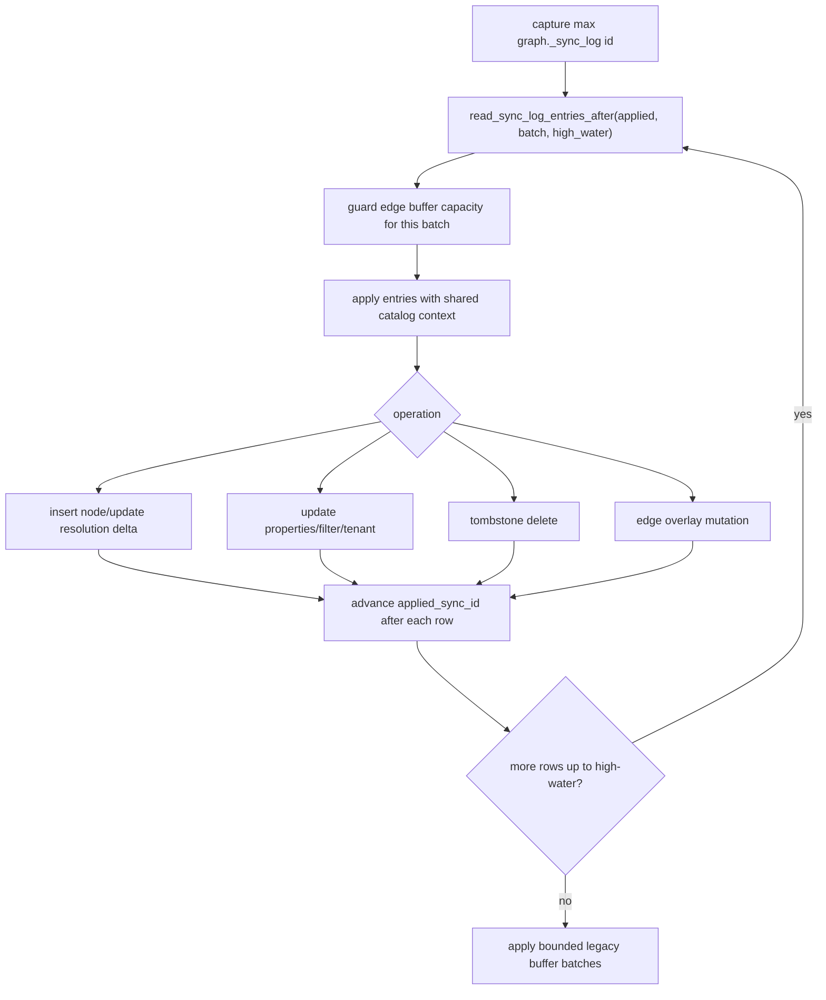

# Sync Internals

Sync bridges mutable source tables and an immutable base CSR graph. The current
implementation uses durable trigger logs, backend-local apply, node
tombstones/inserts, filter refresh, tenant refresh, and edge overlays. Background
workers run build or maintenance jobs; they do not broadcast in-place updates to
every backend-local engine.

## Modules

| Module | Responsibility |
|---|---|
| `sync.rs` | Generate trigger functions/triggers and create sync tables |
| `sql_sync.rs` | Parse sync mode, read durable sync log in bounded batches, apply row changes |
| `sql_build.rs` | Maintenance rebuild and vacuum orchestration |
| `sql_jobs.rs` | Durable job rows and dynamic background worker launch for build/maintenance |
| `engine.rs` | Edge mutation buffer, read-only flag, overlay reduction |
| `persistence.rs` | `.pggraph` load/write plus base-only projection manifest discovery |
| `projection/ingest.rs` | Core committed-row to L0 segment publication logic |
| `projection/layered.rs` | Base CSR plus durable-segment plus transaction-delta layered read source |
| `projection/manifest.rs` | Projection manifest metadata and active-generation heartbeats |
| `projection/normalize.rs` | Deterministic committed-mutation normalization and ingest buffer limits |
| `projection/segment.rs` | Durable delta segment format for future layered projections |

## Durable Tables

Bootstrap and sync schema helpers create:

```text
graph._sync_log
  id bigserial primary key
  op char(1)
  table_oid oid
  table_name text
  pk text
  old_pk text
  new_pk text
  properties jsonb
  old_row jsonb
  new_row jsonb
  xid bigint
  needs_vacuum boolean
  error_message text
  created_at timestamptz

graph._sync_buffer
  legacy compatibility buffer

graph._projection_generations
  generation_id bigint
  backend_pid integer
  database_oid oid
  heartbeat_at timestamptz
  expires_at timestamptz
  sync_watermark bigint
  validation_status text
  repair_status text
  is_current boolean
  published_at timestamptz
  retained_until timestamptz
```

Replay treats `id`, `op`, and `table_name` as required structural fields. The
durable log keeps `old_pk` and `new_pk` nullable because valid operations need
different PK images, while the legacy buffer requires its coalesced old/new PK
fields before replay.

For tables with a registered `tenant_column`, durable sync replay reads old and
new tenant values from captured row images when available. Tenant bitmap
maintenance can then touch only the affected old/new tenant entries; legacy rows
without row images retain the broader compatibility fallback.

## Trigger Capture

Generated triggers capture:

| Operation | Captured data |
|---|---|
| INSERT | new PK and row properties |
| UPDATE | old/new PKs and row images |
| DELETE | old PK and old row |
| TRUNCATE | statement-level table marker; replay uses table membership to tombstone affected nodes |

The trigger layer writes durable rows. It does not update backend-local engines
directly.

## Apply Flow



`graph.sync_batch_size` controls the maximum durable sync rows fetched and
replayed in one internal batch. `graph.apply_sync()` still drains the durable log
that was pending when the call started; the bound is an internal memory and
latency control, not a change to the public admin contract.

`graph.query_freshness = 'apply_pending_sync'` is the default and routes topology
reads through the same high-water replay primitive before they execute. The wired
topology-read entrypoints are traversal variants, shortest-path queries,
weighted shortest-path queries, component APIs, and `graph.traverse_search()`
before its traversal phase. `graph.query_freshness = 'off'` keeps the
compatibility/manual catch-up path available. `graph.search()` remains separate
because it reads source-table properties through SQL rather than graph topology.

`graph.sync_health()` is the operator-facing read model for this state. It
combines backend-local replay progress, durable `_sync_log` high-water state,
freshness configuration, trigger health, projection mode, transaction-delta
counts, and overlay pressure into one row for external schedulers and
monitoring checks.

The durable projection metadata table records published generations and the
backend heartbeats that keep older generations alive while a backend is still
using them. Cleanup logic can only remove derived projection files after they
are no longer referenced by retained manifests or unexpired active-generation
rows. The table is extension-owned operational state; PostgreSQL source tables
remain the authoritative graph data.

Projection manifests are published with a temp-file write, file fsync,
directory fsync, atomic rename, and final directory fsync. Loaders select the
highest final `projection-generation-*.json` file, ignore unrelated or temp
files, then validate the manifest and its active base, segment, and chunk
references before exposing a generation to later read paths.

Projection segments use a fixed little-endian header with magic bytes, version,
kind, level, direction coverage, source-node range, sync watermark, section row
counts, payload offsets, CRC32 checksum, and reserved bytes that must remain
zero. The loader validates offsets, checksum, row bounds, and section ownership
before decoding edge topology/delete/weight sections or node, resolution,
filter, and tenant sections.

Before committed rows are written to segments, normalization sorts rows into a
stable order, groups them by generation, direction, source, target, and edge
type, cancels net-neutral insert/delete pairs, and lets delete rows win
conflicts that still have a net effect. The bounded normalization buffer
rejects oversized batches before segment encoding starts.
Edge segment writers reject normalized node rows so node and edge deltas remain
separate segment domains.

The core projection ingester filters committed sync rows above the latest
manifest watermark, normalizes edge mutations, writes L0 edge segments by
direction, writes node/resolution/filter/tenant L0 deltas into node segments,
publishes durable no-overwrite segment files, validates segment reloads, and
publishes the next manifest under an artifact-root ingestion publication lock.
Aborted transaction rows are ignored, and the manifest watermark advances only
after segment publication succeeds.

The admin-only `graph.ingest_projection(max_rows bigint DEFAULT NULL,
max_bytes bigint DEFAULT NULL)` entrypoint reads committed `graph._sync_log`
rows after the current projection manifest watermark, converts rows through the
same registered table, edge, filter, and tenant catalog semantics as
`graph.apply_sync()`, and publishes the resulting L0 generation beside the
persisted `main.pggraph` artifact. The base graph must be persisted, such as by
building with `graph.persist_on_build = on`; scheduled maintenance treats a
missing persisted artifact as a no-op so existing in-memory sync maintenance
keeps its behavior.

The layered projection runtime merges base CSR neighbors, durable edge
insert/delete/weight segments, durable node visibility and tenant membership
deltas, manifest-referenced base chunk replacements, committed engine
edge-buffer overlays, and transaction-local edge deltas in a fixed order. Base
CSR is read first, base chunks replace their covered source-node ranges,
durable tombstones suppress older base or segment edges, later durable inserts
can reactivate an edge, duplicate edges are suppressed, committed
`engine.edge_buffer` changes remain visible while a manifest-backed snapshot is
active, and transaction-local deltas are applied last for read-your-own-writes
semantics.
When a loaded projection manifest references durable segments, traversal,
unweighted shortest path, weighted shortest path, connected components, and GQL
relationship expansion select this layered runtime. `csr_readonly` mode and
base-only manifests keep the clean CSR fast path and avoid segment lookup.

Dirty base CSR ranges are repaired by publishing immutable base chunk files and
referencing them from the next projection manifest generation. A base chunk is a
full replacement for an inclusive/exclusive source-node range and carries its
own checksum plus dirty source/edge counters. Publishing a replacement manifest
does not remove older chunk files, so older generations remain readable until
generation-aware cleanup makes them obsolete. If a chunk checksum fails,
targeted repair rewrites the corrupted range into a new generation.

When a `.pggraph` artifact is loaded, the loader scans the artifact directory
for the latest `projection-generation-*.json` manifest. In the base-only phase,
the engine installs only manifests that reference the loaded `.pggraph` file,
match the current artifact format version and CRC32 checksum, and have no
segment or chunk references. The active read path remains CSR for those
manifests. Segment-backed manifests are installed with mutable-overlay read
mode so public read APIs consume durable L0/L1/L2 segment deltas after reload.
The engine keeps only the base manifest generation and sync watermark as status
metadata until the status/diagnostics phase.
The SQL `graph.status()` table is already at pgrx's tuple-return arity limit, so
new durable projection SQL status fields are deferred to the status/diagnostics
phase that can refactor the SQL shape deliberately.

Scheduler ownership intentionally stays outside the extension. PostgreSQL
background-worker lifecycle, crash recovery, privilege boundaries, and cadence
controls belong to pg_cron, Kubernetes CronJobs, systemd timers, Docker init
SQL, or application schedulers; the stable pgGraph boundary is the admin-only
`graph.run_scheduled_maintenance()` call.

## Node Changes

Mmap-backed node stores cannot be mutated. Before node mutation, the engine
materializes node data into owned arrays. Inserted nodes are appended and added
to the indexed `resolution_delta`; deleted nodes are tombstoned through
`NodeStore`.

## Edge Changes

The base `EdgeStore` remains immutable. Committed sync edge mutations are
appended to `engine.edge_buffer` as `EdgeMutation` values. Transaction-local
edge deltas live in `TxGraphDelta`. Overlay-aware graph algorithms reduce both
sources into insert and delete overlays for the selected direction, with
transaction-local deltas applied last for read-your-own-writes semantics.
Traversal, unweighted shortest path, and connected components consume the
shared neighbor-source abstraction. Read-only GQL relationship expansion uses
the same overlay-aware neighbor path. Weighted shortest path rejects a dirty
edge overlay until vacuum or maintenance merges committed weights into the base
CSR.

When the buffer reaches `graph.edge_buffer_size`, the engine enters read-only
mode with `read_only_reason = 'edge_buffer_full'` and returns
`EdgeBufferFull`. Later sync mutations against an already read-only engine
return `ReadOnly` with the stored reason.

## Filter And Tenant Refresh

`sql_sync.rs` can refresh registered filter values from new row properties and
update tenant membership. Tenant membership is a `HashMap<String,
RoaringBitmap>` from tenant value to node indices.

## Maintenance Rebuild

Maintenance applies pending sync state and rebuilds from source tables. This
folds:

| State | Folded into |
|---|---|
| Tombstones | Fresh NodeStore without deleted rows |
| Edge overlays | Fresh CSR stores |
| Resolution delta | Fresh finalized ResolutionIndex |
| Filter changes | Fresh FilterIndex |
| Tenant membership | Fresh tenant bitmaps |

## Status Interaction

Runtime status and graph validation refresh:

| Field | Source |
|---|---|
| `pending_sync_rows` | Count of sync log rows above `applied_sync_id` |
| `disabled_trigger_count` | Catalog inspection of disabled graph triggers |
| `schema_state` | Current catalog/schema drift validation |
| `needs_vacuum` | Edge/tombstone overlay state |
| `needs_rebuild` | Catalog/schema drift |

## Current Boundaries

| Boundary | Current code behavior |
|---|---|
| WAL sync mode | Reserved and rejected for active use |
| Query-time hidden catch-up | Queries do not silently apply all pending durable sync rows |
| CSR mutation | Not supported; use overlays then rebuild |
| Cross-backend engine sync | Backend-local; persisted files and source tables coordinate state |
