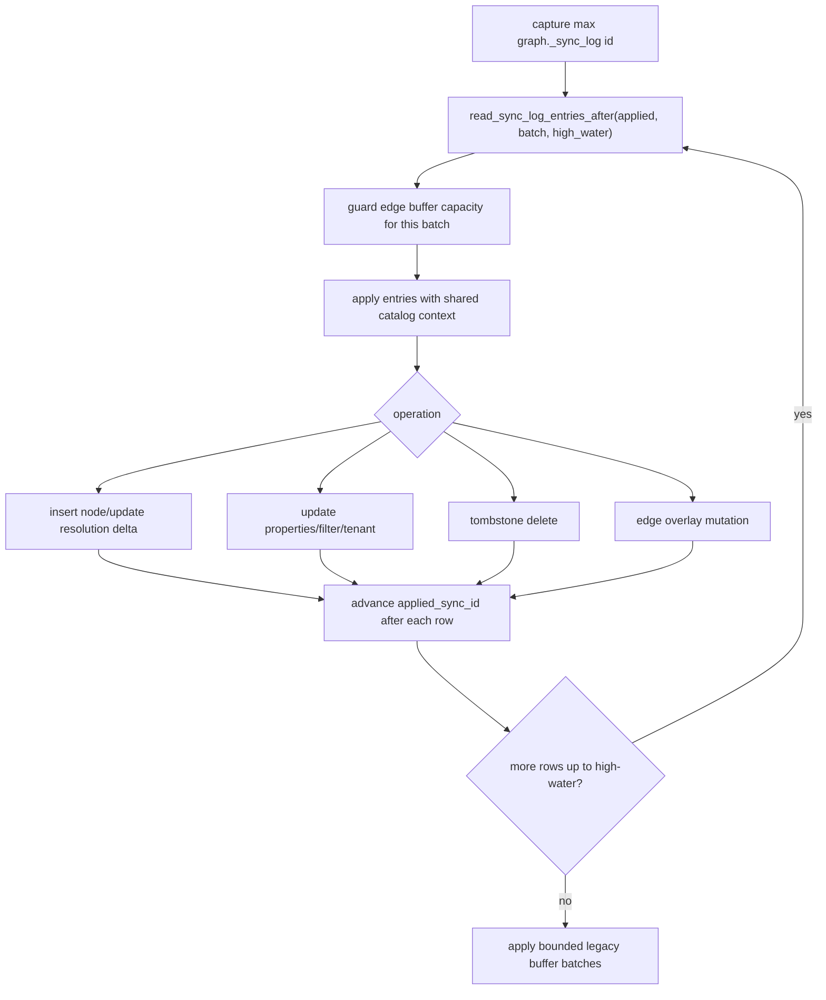

# Sync Internals

Sync bridges mutable source tables and an immutable base CSR graph. The current
implementation uses durable trigger logs, backend-local apply, node
tombstones/inserts, filter refresh, tenant refresh, and edge overlays. Background
workers run build or maintenance jobs; they do not broadcast in-place updates to
every backend-local engine.

## Modules

| Module | Responsibility |
|---|---|
| `sync.rs` | Generate trigger functions/triggers and create sync tables |
| `sql_sync.rs` | Parse sync mode, read durable sync log in bounded batches, apply row changes |
| `sql_build.rs` | Maintenance rebuild and vacuum orchestration |
| `sql_jobs.rs` | Durable job rows and dynamic background worker launch for build/maintenance |
| `engine.rs` | Edge mutation buffer, read-only flag, overlay reduction |

## Durable Tables

Bootstrap and sync schema helpers create:

```text
graph._sync_log
  id bigserial primary key
  op char(1)
  table_oid oid
  table_name text
  pk text
  old_pk text
  new_pk text
  properties jsonb
  old_row jsonb
  new_row jsonb
  xid bigint
  needs_vacuum boolean
  error_message text
  created_at timestamptz

graph._sync_buffer
  legacy compatibility buffer
```

Replay treats `id`, `op`, and `table_name` as required structural fields. The
durable log keeps `old_pk` and `new_pk` nullable because valid operations need
different PK images, while the legacy buffer requires its coalesced old/new PK
fields before replay.

For tables with a registered `tenant_column`, durable sync replay reads old and
new tenant values from captured row images when available. Tenant bitmap
maintenance can then touch only the affected old/new tenant entries; legacy rows
without row images retain the broader compatibility fallback.

## Trigger Capture

Generated triggers capture:

| Operation | Captured data |
|---|---|
| INSERT | new PK and row properties |
| UPDATE | old/new PKs and row images |
| DELETE | old PK and old row |
| TRUNCATE | statement-level table marker; replay uses table membership to tombstone affected nodes |

The trigger layer writes durable rows. It does not update backend-local engines
directly.

## Apply Flow



`graph.sync_batch_size` controls the maximum durable sync rows fetched and
replayed in one internal batch. `graph.apply_sync()` still drains the durable log
that was pending when the call started; the bound is an internal memory and
latency control, not a change to the public admin contract.

`graph.query_freshness = 'apply_pending_sync'` is the default and routes topology
reads through the same high-water replay primitive before they execute. The wired
topology-read entrypoints are traversal variants, shortest-path queries,
weighted shortest-path queries, component APIs, and `graph.traverse_search()`
before its traversal phase. `graph.query_freshness = 'off'` keeps the
compatibility/manual catch-up path available. `graph.search()` remains separate
because it reads source-table properties through SQL rather than graph topology.

`graph.sync_health()` is the operator-facing read model for this state. It
combines backend-local replay progress, durable `_sync_log` high-water state,
freshness configuration, trigger health, projection mode, transaction-delta
counts, and overlay pressure into one row for external schedulers and
monitoring checks.

Scheduler ownership intentionally stays outside the extension. PostgreSQL
background-worker lifecycle, crash recovery, privilege boundaries, and cadence
controls belong to pg_cron, Kubernetes CronJobs, systemd timers, Docker init
SQL, or application schedulers; the stable pgGraph boundary is the admin-only
`graph.run_scheduled_maintenance()` call.

## Node Changes

Mmap-backed node stores cannot be mutated. Before node mutation, the engine
materializes node data into owned arrays. Inserted nodes are appended and added
to the indexed `resolution_delta`; deleted nodes are tombstoned through
`NodeStore`.

## Edge Changes

The base `EdgeStore` remains immutable. Committed sync edge mutations are
appended to `engine.edge_buffer` as `EdgeMutation` values. Transaction-local
edge deltas live in `TxGraphDelta`. Overlay-aware graph algorithms reduce both
sources into insert and delete overlays for the selected direction, with
transaction-local deltas applied last for read-your-own-writes semantics.
Traversal, unweighted shortest path, and connected components consume the
shared neighbor-source abstraction. Read-only GQL relationship expansion uses
the same overlay-aware neighbor path. Weighted shortest path rejects a dirty
edge overlay until vacuum or maintenance merges committed weights into the base
CSR.

When the buffer reaches `graph.edge_buffer_size`, the engine enters read-only
mode with `read_only_reason = 'edge_buffer_full'` and returns
`EdgeBufferFull`. Later sync mutations against an already read-only engine
return `ReadOnly` with the stored reason.

## Filter And Tenant Refresh

`sql_sync.rs` can refresh registered filter values from new row properties and
update tenant membership. Tenant membership is a `HashMap<String,
RoaringBitmap>` from tenant value to node indices.

## Maintenance Rebuild

Maintenance applies pending sync state and rebuilds from source tables. This
folds:

| State | Folded into |
|---|---|
| Tombstones | Fresh NodeStore without deleted rows |
| Edge overlays | Fresh CSR stores |
| Resolution delta | Fresh finalized ResolutionIndex |
| Filter changes | Fresh FilterIndex |
| Tenant membership | Fresh tenant bitmaps |

## Status Interaction

Runtime status and graph validation refresh:

| Field | Source |
|---|---|
| `pending_sync_rows` | Count of sync log rows above `applied_sync_id` |
| `disabled_trigger_count` | Catalog inspection of disabled graph triggers |
| `schema_state` | Current catalog/schema drift validation |
| `needs_vacuum` | Edge/tombstone overlay state |
| `needs_rebuild` | Catalog/schema drift |

## Current Boundaries

| Boundary | Current code behavior |
|---|---|
| WAL sync mode | Reserved and rejected for active use |
| Query-time hidden catch-up | Queries do not silently apply all pending durable sync rows |
| CSR mutation | Not supported; use overlays then rebuild |
| Cross-backend engine sync | Backend-local; persisted files and source tables coordinate state |
