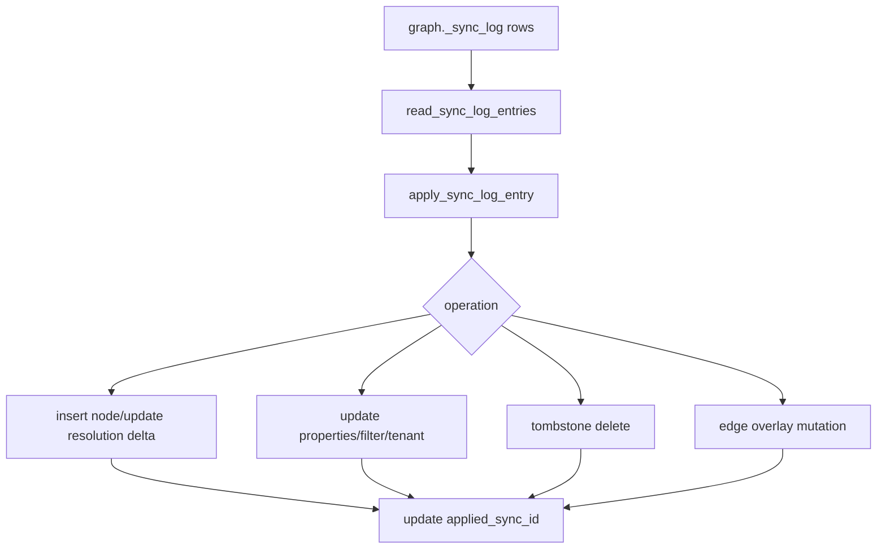

# Sync Internals

Sync bridges mutable source tables and an immutable base CSR graph. The current
implementation uses durable trigger logs, backend-local apply, node
tombstones/inserts, filter refresh, tenant refresh, and edge overlays. Background
workers run build or maintenance jobs; they do not broadcast in-place updates to
every backend-local engine.

## Modules

| Module | Responsibility |
|---|---|
| `sync.rs` | Generate trigger functions/triggers and create sync tables |
| `sql_sync.rs` | Parse sync mode, read durable sync log, apply row changes |
| `sql_build.rs` | Maintenance rebuild and vacuum orchestration |
| `sql_jobs.rs` | Durable job rows and dynamic background worker launch for build/maintenance |
| `engine.rs` | Edge mutation buffer, read-only flag, overlay reduction |

## Durable Tables

Bootstrap and sync schema helpers create:

```text
graph._sync_log
  id bigserial primary key
  op char(1)
  table_oid oid
  table_name text
  pk text
  old_pk text
  new_pk text
  properties jsonb
  old_row jsonb
  new_row jsonb
  xid bigint
  needs_vacuum boolean
  error_message text
  created_at timestamptz

graph._sync_buffer
  legacy compatibility buffer
```

Replay treats `id`, `op`, and `table_name` as required structural fields. The
durable log keeps `old_pk` and `new_pk` nullable because valid operations need
different PK images, while the legacy buffer requires its coalesced old/new PK
fields before replay.

## Trigger Capture

Generated triggers capture:

| Operation | Captured data |
|---|---|
| INSERT | new PK and row properties |
| UPDATE | old/new PKs and row images |
| DELETE | old PK and old row |
| TRUNCATE | statement-level rebuild-needed marker |

The trigger layer writes durable rows. It does not update backend-local engines
directly.

## Apply Flow



## Node Changes

Mmap-backed node stores cannot be mutated. Before node mutation, the engine
materializes node data into owned arrays. Inserted nodes are appended and added
to `resolution_delta`; deleted nodes are tombstoned through `NodeStore`.

## Edge Changes

The base `EdgeStore` remains immutable. Edge mutations are appended to
`engine.edge_buffer` as `EdgeMutation` values. Traversal reduces this buffer
into insert and delete overlays for the selected direction.

When the buffer reaches `graph.edge_buffer_size`, the engine enters read-only
mode and returns `EdgeBufferFull`.

## Filter And Tenant Refresh

`sql_sync.rs` can refresh registered filter values from new row properties and
update tenant membership. Tenant membership is a `HashMap<String,
RoaringBitmap>` from tenant value to node indices.

## Maintenance Rebuild

Maintenance applies pending sync state and rebuilds from source tables. This
folds:

| State | Folded into |
|---|---|
| Tombstones | Fresh NodeStore without deleted rows |
| Edge overlays | Fresh CSR stores |
| Resolution delta | Fresh finalized ResolutionIndex |
| Filter changes | Fresh FilterIndex |
| Tenant membership | Fresh tenant bitmaps |

## Status Interaction

Runtime status and graph validation refresh:

| Field | Source |
|---|---|
| `pending_sync_rows` | Count of sync log rows above `applied_sync_id` |
| `disabled_trigger_count` | Catalog inspection of disabled graph triggers |
| `schema_state` | Current catalog/schema drift validation |
| `needs_vacuum` | Edge/tombstone overlay state |
| `needs_rebuild` | Catalog/schema drift |

## Current Boundaries

| Boundary | Current code behavior |
|---|---|
| WAL sync mode | Reserved and rejected for active use |
| Query-time hidden catch-up | Queries do not silently apply all pending durable sync rows |
| CSR mutation | Not supported; use overlays then rebuild |
| Cross-backend engine sync | Backend-local; persisted files and source tables coordinate state |
