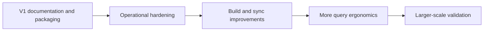

# Roadmap

<Callout type="info">
This roadmap is directional. It describes the work pgGraph is designed around,
not a dated release commitment.
</Callout>

pgGraph's roadmap keeps one boundary fixed: PostgreSQL remains the source of
truth. New features should make graph-shaped SQL workloads easier to operate
inside PostgreSQL, without turning pgGraph into a separate graph database.
Future graph-language work should be standards-aligned, optional, and backed by
the same PostgreSQL-authoritative projection model as the SQL function APIs.

## Current Baseline

The current engine already supports the core SQL workflow:

| Area | Current behavior |
|---|---|
| Registration | Manual table and edge registration plus schema auto-discovery. |
| Querying | Bounded traversal, shortest paths, weighted shortest paths, path reconstruction, source search, workflow helpers, and connected components. |
| Maintenance | Explicit build, persist, load, sync apply, vacuum, stats, and background job entry points. |
| Sync | Trigger-buffered change capture with explicit foreground or background apply. |
| Persistence | Atomic `.pggraph` artifacts under PostgreSQL data storage. Immutable forward graph arrays and resolution are read-only mmap-backed on load; reverse CSR and bincode metadata are backend-local heap structures. |
| Safety | ACL preflight, SQLSTATE mapping, circuit breakers, OOM checks, and panic-to-PostgreSQL-error boundaries. |

```text
current stable core
    |
    +-- SQL-first graph queries
    +-- trigger-buffered sync
    +-- read-only mapped launch artifacts
    +-- release and safety hardening
```

## Open Source V1 Focus

The immediate open-source focus is deliberately practical: make the existing
system easy to install, easy to verify, and hard to misunderstand.

| Area | Direction |
|---|---|
| Documentation | Keep SQL user docs and Rust contributor docs in the Nextra docs tree as the single source of truth. |
| Packaging | Tighten source install, package validation, fresh install smoke tests, and PostgreSQL 14-18 release evidence. |
| CI/CD | Start with unit/static checks on every change, then add PostgreSQL-backed pgrx integration jobs, then promote heavy release gates to scheduled or manual release validation. |
| Examples | Maintain small examples for quick evaluation and realistic examples for operational guidance. |
| API clarity | Document every exported SQL function, reserved option, error class, and security boundary. |
| Operations | Keep backup/restore, crash recovery, concurrency, memory, and package checks reproducible from documented scripts. |

## Near-Term Work



| Area | Planned improvement |
|---|---|
| Build observability | Better progress, sizing, and failure diagnostics around `graph.build()` and persisted artifacts. |
| CI/CD rollout | First gate `cargo fmt --check`, `cargo clippy`, `cargo test`, `cargo doc`, and docs drift checks; next gate `cargo pgrx test`; final gate synthetic/heavy release scripts. |
| Sync operations | Clearer scheduling, monitoring, and failure handling around trigger-buffered sync and background maintenance jobs. |
| Artifact tooling | More direct inspection and compatibility checks for persisted graph files. |
| Query ergonomics | More examples around strict traversal specs, typed filters, workflow helpers, and pagination. |
| Benchmarks | More end-to-end SQL benchmarks that separate PostgreSQL execution, graph traversal, hydration, client overhead, and PostgreSQL SQL/PGQ comparisons as PostgreSQL 19 matures. |

## Alpha Hardening Status

The critical-path alpha hardening pass has landed the correctness, durability,
SQL contract, sync freshness, and operator diagnostics work that was blocking a
clearer public baseline.

| Track | Status | Notes |
|---|---|---|
| Data correctness | Complete | Edge endpoint validation and exact hydration numeric comparisons fail closed instead of silently producing wrong answers. |
| SQL contract | Complete for the critical path | Weighted shortest paths return stable step rows; search and traversal pagination contracts are documented and tested. |
| Persistence safety | Complete for the critical path | Persisted PK UTF-8, resolution collisions, mmap region bounds, and missing `PGDATA` behavior are validated. |
| SQL boundary safety | Complete for search | Source search binds user values through SPI parameters and inspects generated SQL in tests. Other catalog-derived dynamic SQL remains tracked in Known Issues. |
| Sync freshness | Complete for topology reads | Topology reads auto-apply pending trigger sync rows by default up to a captured high-water mark; `graph.query_freshness = 'off'` preserves manual mode. |
| Scheduler integration | Available | `graph.run_scheduled_maintenance()` is scheduler-safe and documented for `pg_cron` or external schedulers. The Docker image enables `pg_cron` and installs a five-minute maintenance schedule. |
| Operator diagnostics | Complete for the critical path | `graph.status()`, `graph.sync_health()`, build jobs, and maintenance jobs expose read-only reasons and progress diagnostics. |

## Continuous Improvement

There is always another way to optimize a graph engine, especially one that
runs inside PostgreSQL backend processes and must respect PostgreSQL memory,
locking, ACL, and durability semantics. The launch priority is therefore
deliberate: make the critical correctness, persistence, safety, and operational
paths work first, then continue improving performance and ergonomics in the
open.

The current public follow-up list is tracked in [Known Issues](./known-issues).
Work is ranked by user impact:

| Priority | Focus | Examples |
|---|---|---|
| P0 | Operational visibility and resource predictability | Build/vacuum diagnostics, sync backlog visibility, clearer read-only states, better memory estimates. |
| P1 | Query performance follow-ups | Traversal scratch reuse, connected-component row materialization, hydration setup, source-search rechecks. |
| P2 | SQL ergonomics and documented semantics | No active public rows after structured filters gained text predicates, membership, range, and null semantics. |
| P3 | Internals and maintainability | pg test locality once pgrx supports the needed out-of-line schema module shape. |

The bias is to optimize with evidence. For hot paths, we prefer benchmarks or
release-style SQL tests that show whether an allocation, SPI call, sort, clone,
or hash lookup is actually material to user workloads.

## Semantic-Guided Search

Semantic-guided search is a distinct direction for pgGraph: combine graph
structure, relationship constraints, and pgVector-backed node embeddings to
find relevant paths without letting high-degree nodes dominate bounded
traversal.

The first shape should be a `guided_path()` style API rather than a promise of
exact A* behavior. It should keep PostgreSQL as the source of truth while
ranking candidate expansions with multiple signals:

| Signal | Purpose |
|---|---|
| Vector distance | Prefer nodes semantically closer to the target or query embedding. |
| Edge and path cost | Preserve compatibility with weighted graph search where callers have meaningful costs. |
| Degree penalty | Avoid expanding super nodes unless their semantic or structural value justifies the branching cost. |
| Edge type preference | Let callers constrain or bias search toward useful relationship classes. |
| Bidirectional expansion | Shrink the search space where directed-edge semantics allow safe forward/backward search. |
| Beam width and circuit breakers | Keep latency and memory predictable with bounded candidate sets, max-node caps, max-depth caps, and diagnostics. |

This path should be documented as approximate, relevance-ranked search. Exact
shortest-path behavior remains the job of `shortest_path()` and
`weighted_shortest_path()`.

Future work can add full A* as a specialized mode, but only for cost models
where the heuristic can be made admissible. pgVector distance alone is likely
better treated as a semantic ranking signal unless edge costs are intentionally
designed around the same metric.

## Reserved Features

Some configuration values and internals are intentionally shaped for future
work, but are not current behavior.

| Feature | Current status | Roadmap direction |
|---|---|---|
| WAL-driven sync | `graph.sync_mode = 'wal'` is reserved and rejected when selected. | Logical replication based sync for deployments that should avoid trigger-buffer volume. |
| COPY build scanner | `graph.build_scan_mode = 'copy'` is reserved and rejected when selected. | A server-side COPY scanner once it can preserve the same validation, error, and memory guarantees as the current SPI path. |
| GQL and SQL/PGQ frontends | Not part of the current public API. | Investigate a GQL-compatible query frontend and SQL/PGQ adapter path over a shared graph planner. API reference docs should be added only when SQL functions exist. |
| Online mutable graph overlays | Not part of the current query path. | Investigate a `mutable_overlay` projection mode built as deltas over the immutable CSR base. Keep `csr_readonly` as the fast read-mostly mode and do not mutate CSR in place. |
| pgVector embedding cache | Node embeddings are not part of the graph artifact or traversal hot path. | Investigate a sidecar or persisted embedding cache keyed by internal node IDs so semantic-guided search can rank candidates without source-table lookups inside the search loop. |
| Full A* path search | Not current behavior. Existing shortest paths use bidirectional BFS and weighted paths use Dijkstra. | Consider as a specialized semantic-guided search mode only when the heuristic has an explicit admissibility contract. |
| Additional graph analytics | Connected components exist today; PageRank, Louvain, betweenness, and similar global algorithms are not built in. | Consider companion analytics paths where they fit PostgreSQL operations and do not slow the hot traversal path. |
| Distributed graph execution | Not a V1 goal. | Revisit only after the single-database engine, packaging, and operational model are mature. |

## Non-Goals

pgGraph is not trying to become:

| Non-goal | Reason |
|---|---|
| A replacement storage engine | PostgreSQL tables, indexes, constraints, ACLs, and RLS remain the system of record. |
| A separate graph database hidden inside PostgreSQL | Graph-language support, if added, must compile to PostgreSQL-authoritative graph projections rather than creating a second durable store. |
| Broad Cypher, Gremlin, or SPARQL compatibility | The standards direction is GQL and SQL/PGQ first. Other graph-language compatibility should be considered only as a later compatibility layer. |
| A distributed graph database | The current architecture is local to one PostgreSQL database. |
| A global analytics engine in the OLTP query path | Expensive whole-graph algorithms need different scheduling and resource controls than bounded traversal. |

## Documentation Policy

Going forward, project documentation should live under `docs/`.

- SQL behavior, installation, operations, and examples belong in
  `docs/user_guide/`.
- Rust internals, persistence, safety, memory, tests, and release process belong
  in `docs/contributor_guide/`.
- The top-level overview and system design stay directly under `docs/`.
- Quickstart and roadmap pages live directly under `docs/`; user guide and
  contributor guide pages live under `docs/user_guide/` and
  `docs/contributor_guide/`.
- Repository-local README files should stay small pointers or be removed when
  they duplicate the docs tree.
