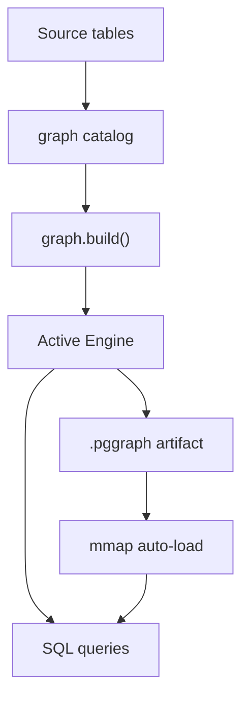

# pgGraph User Guide

`graph` is a PostgreSQL extension that lets you search, traverse, and explain
relationships in ordinary PostgreSQL tables. You register the tables and
relationships that matter, build the graph, and keep using SQL.

PostgreSQL remains the source of truth. pgGraph handles the graph index,
bounded traversal, path reconstruction, persistence, and maintenance behind the
`graph` schema.

<Callout type="info">
The current public API is PostgreSQL SQL functions in the `graph` schema,
including a documented GQL-compatible subset through `graph.gql()`. pgGraph has
an internal SQL/PGQ adapter seam for future PostgreSQL-owned graph-pattern
hooks, but no public SQL/PGQ API is exposed yet.
</Callout>

## What It Does For You

| Area | What you get |
|---|---|
| Table registration | Manual registration with `graph.add_table()` or discovery with `graph.auto_discover()` and `graph.auto_discover_tables()` |
| Edge registration | FK-style edges and edge-table style relationships through `graph.add_edge()` |
| Search | Source-table SQL search over registered columns with `contains`, `exact`, `prefix`, and `token` modes |
| Traversal | Bounded BFS and DFS over CSR edges with direction, edge type, table, tenant, filter, hydration, pagination, and circuit breaker options |
| GQL | A documented GQL-compatible graph-pattern subset, single-node mapped `CREATE`, mapped property `SET`, and mapped edge-row `DELETE`, returned as JSONB rows |
| Paths | Unweighted shortest path, weighted shortest path when edge weights are registered, readable path helpers, and workflow wrappers |
| Components | Admin-only connected component summaries and paginated component membership |
| Filtering | Traversal-time typed filter pushdown for registered filter columns |
| Aggregation | Strict JSON traversal specs for path counting and server-side aggregates |
| Sync | Manual rebuild, trigger-log apply, foreground/background maintenance, and full rebuild vacuum |
| Persistence | Fast backend startup from a validated `.pggraph` artifact when enabled |

## First Build

```sql
CREATE EXTENSION graph;

SELECT graph.add_table(
  'public.customers'::regclass,
  id_column := 'id',
  columns := ARRAY['name', 'email']
);

SELECT graph.add_table(
  'public.orders'::regclass,
  id_column := 'id',
  columns := ARRAY['status']
);

SELECT graph.add_edge(
  from_table := 'public.orders'::regclass,
  from_column := 'customer_id',
  to_table := 'public.customers'::regclass,
  to_column := 'id',
  label := 'placed_by',
  bidirectional := true
);

SELECT * FROM graph.build();
```

## First Queries

```sql
SELECT *
FROM graph.search('name', 'Alice', mode := 'contains');

SELECT *
FROM graph.traverse(
  'public.customers'::regclass,
  '42',
  max_depth := 3
);

SELECT *
FROM graph.shortest_path(
  'public.customers'::regclass,
  '42',
  'public.customers'::regclass,
  '99'
);

SELECT row
FROM graph.gql(
  'MATCH (o:orders)-[:placed_by]->(c:customers)
   RETURN o.status AS status, c.name AS customer
   LIMIT 10'
);
```

## Mental Model

```text
PostgreSQL tables
      |
      | graph.add_table(), graph.add_edge(), graph.add_filter_column()
      v
graph catalog tables
      |
      | graph.build()
      v
backend-local Engine
      |
      +-- NodeStore          source table OID, primary key, active bit
      +-- EdgeStore          CSR adjacency arrays
      +-- reverse EdgeStore  inbound traversal
      +-- ResolutionIndex    table+PK to node index
      +-- FilterIndex        typed traversal filter columns
      |
      | graph.persist_on_build = true
      v
$PGDATA/<graph.data_dir>/main.pggraph
      |
      | graph.auto_load = true
      v
mmap-backed base graph in later backends
```

For day-to-day SQL use, that is the whole model: source tables, graph catalog,
active engine, SQL results.



## Recommended Reading Order

1. [Quickstart](/quickstart) to try the full loop in a scratch database.
2. [Installation](/user_guide/installation) to compile, install, and load the extension.
3. [Schema Registration](/user_guide/schema-registration) to model tables and edges.
4. [Build And Persistence](/user_guide/build-and-persistence) to build and load the base graph.
5. [Querying](/user_guide/querying) for search, traversal, workflow wrappers, paths, and components.
6. [Sync And Maintenance](/user_guide/sync-and-maintenance) to choose refresh workflows.
7. [Limitations And Fit](/user_guide/limitations-and-fit) before production rollout.
8. [Playground](/user_guide/playground) to run the Docker-backed SQL inspector.
9. [SQL API Reference](/user_guide/api-reference) for complete function signatures and return columns.

<Callout type="warning">
The active engine is built from source tables and may include backend-local sync
overlays. Background build and maintenance workers can rebuild and persist a new
base graph, but they do not continuously mutate every backend's already-loaded
engine in place.
</Callout>
